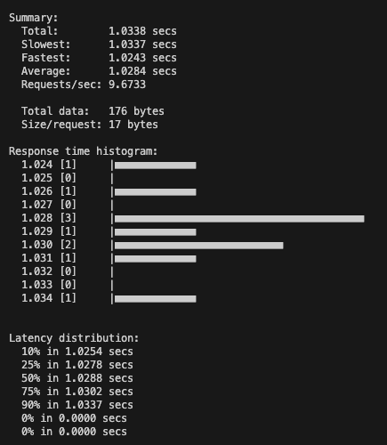
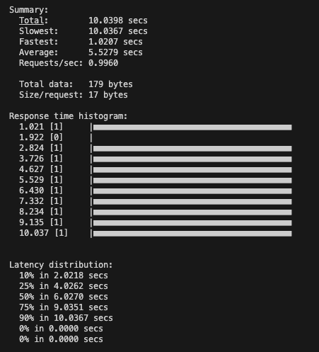
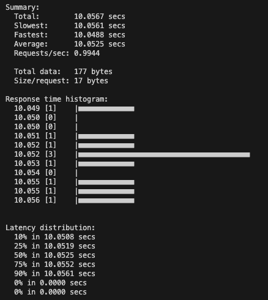
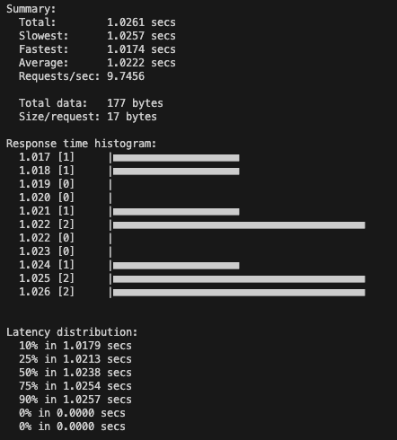
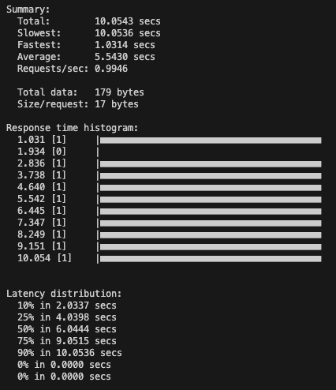
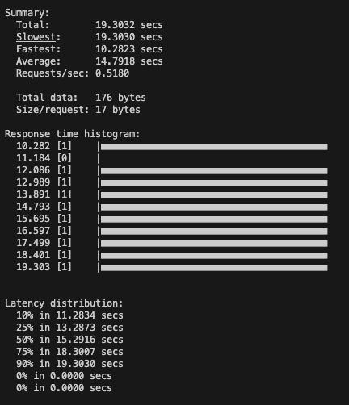
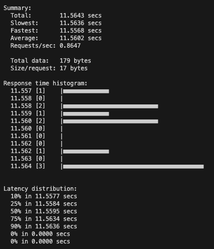
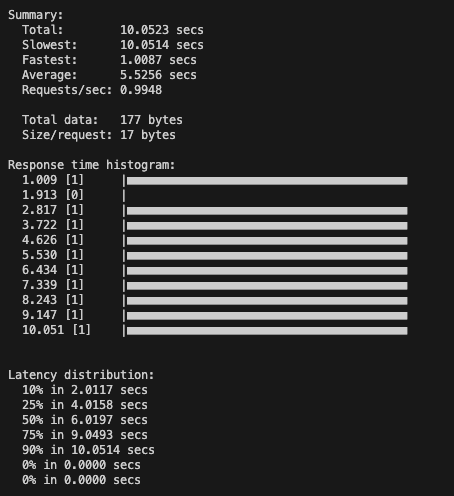

# Experimenting with workers and threads in FastAPI

This repo is an experimentation to understand how concurrency and parallelism works with FastAPI. The ideas I'll be testing are:

1. Scenario 1: Sending requests one after the other to the same endpoint and same path
2. Scenario 2: Sending requests one after the other to two different endpoints on the same app

I am interested in understanding the behaviour of `async` and `sync` path definitions in FastAPI.

## Basic setup

```bash
# Clone the repo and `cd` to the repo folder
$ pip install -r requirements.txt
$ brew install hey
# Start the service
$ python -m service.server # To exit the service, simply press `CMD+C`
```

This basic service has 2 endpoints and both endpoints have 2 paths:

- Endpoint: `e1`
  - Path: `p1` (`def`, 10 second wait)
  - Path: `p2` (`async def`, 1 second wait)
- Endpoint: `e2`
  - Path: `p1` (`def`, 1 second wait)
  - Path: `p2` (`async def`, 1 second wait)

## Scenario 1: Sending requests one after the other to the same endpoint and same path

- What happens if we have 1 endpoint and 1 path?
- Open another terminal window for this experimentation setup

### Setup 1

- If we send requests one after the other to the same endpoint with `def` method(without `async`) my assumption is that requests will be served sequentially and the last request will have to wait for a long time.

```bash
# Will send 10 requests concurrently to an endpoint with def path which internally waits for 1 second
$ hey -n 10 -c 10 http://localhost:8888/e2/p1
```

### Result 1



Hmm.., this is wierd. All requests are processed parallely even when the path `p1` of endpoint `e2` is defined to by `def`.

### Setup 2

- If we send requests one after the other to the same endpoint with `async def` method my assumption is that requests will be served concurrently and almost all the requests will be returned in the same time.

```bash
# Will send 10 requests concurrently to an endpoint with async def path which internally waits for 1 second
$ hey -n 10 -c 10 http://localhost:8888/e2/p2
```

### Result 2



Again, the result is completely the opposite of what I expected.

## Scenario 2: Sending requests one after the other to two different endpoints on the same app

- What happens if we have 2 endpoints and separate paths in both of them?
- Open another terminal window for this experimentation setup

### Setup 3

- If we send requests one after the other to two different endpoints `e1` and `e2`. Both of them have paths which are `def` methods (without `async`).

In one terminal window

```bash
# Will send 10 requests concurrently to an endpoint with def path which internally waits for 10 seconds
$ hey -n 10 -c 10 http://localhost:8888/e1/p1
```

In another terminal window

```bash
# Will send 10 requests concurrently to an endpoint with def path which internally waits for 1 second
$ hey -n 10 -c 10 http://localhost:8888/e2/p1
```

### Result 3

Endpoint 1



Endpoint 2



All 20 requests are processed parallely in both the endpoints.

### Setup 4

- If we send requests one after the other to two different endpoints `e1` and `e2`. Both of them have paths which are `async def` methods.

In one terminal window

```bash
# Will send 10 requests concurrently to an endpoint with async def path which internally waits for 1 second
$ hey -n 10 -c 10 http://localhost:8888/e1/p2
```

In another terminal window

```bash
# Will send 10 requests concurrently to an endpoint with async def path which internally waits for 1 second
$ hey -n 10 -c 10 http://localhost:8888/e2/p2
```

### Result 4

Endpoint 1



Endpoint 2



All 20 requests are processed sequentially one after the other.

### Setup 5

- If we send requests one after the other to two different endpoints `e1` and `e2`. One of the endpoint has `async` mthod and other is a simple `def` method

In one terminal window

```bash
# Will send 10 requests concurrently to an endpoint with def path which internally waits for 10 seconds
$ hey -n 10 -c 10 http://localhost:8888/e1/p1
```

In another terminal window

```bash
# Will send 10 requests concurrently to an endpoint with async def path which internally waits for 1 second
$ hey -n 10 -c 10 http://localhost:8888/e2/p2
```

### Result 5

Endpoint 1



Endpoint 2



Endpoint 1 processes all requests parallely. Endpoint 2 processes requests sequentially. Depending on how you run it the time distribution might be a different.
